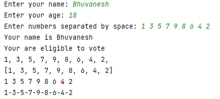

# IOUtils
Python input and print function in Java

This is just for fun!

### Add it in your root build.gradle at the end of repositories:
```
allprojects {
    repositories {
        ...
        maven { url 'https://jitpack.io' }
    }
}
```

### Add the dependency
```
dependencies {
    implementation 'com.github.Bhuvaneshw.ioutil:IOUtil:v2.2'
}
```

### Latest Release
[](https://jitpack.io/#Bhuvaneshw/ioutil)

### Sample code
```
public class Main {
    public static void main(String[] args) {
        String name = input("Enter your name: ");
        int age = toInt(input("Enter your age: "));
        String[] strings = input("Enter numbers separated by space: ").split(" ");
        ArrayList<Integer> ints = mapInt(strings);
        print("Your name is", name);
        print("Your are", age >= 18 ? "" : "not", "eligible to vote");
        for (int i : ints) {
            printEnd(", ", i);
        }
        print();
        print(ints);
        print(ints.toArray());
        printSep("-", ints.toArray());
    }
}
```

### Output


